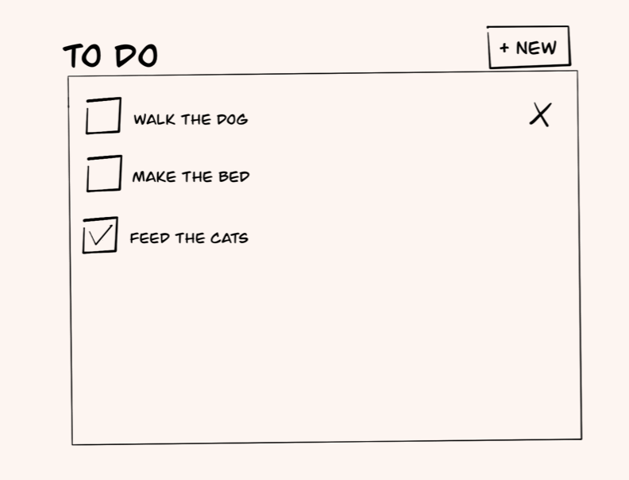

# Todo list

## Getting started 
//:todo add instructions

## System requirements 
A user can:

- Add tasks 
- Complete tasks (mark them as done)
- Edit tasks 
- Delete tasks 
- See how many tasks are remaining 

Aiming for it to look something like this..

### Approach 
